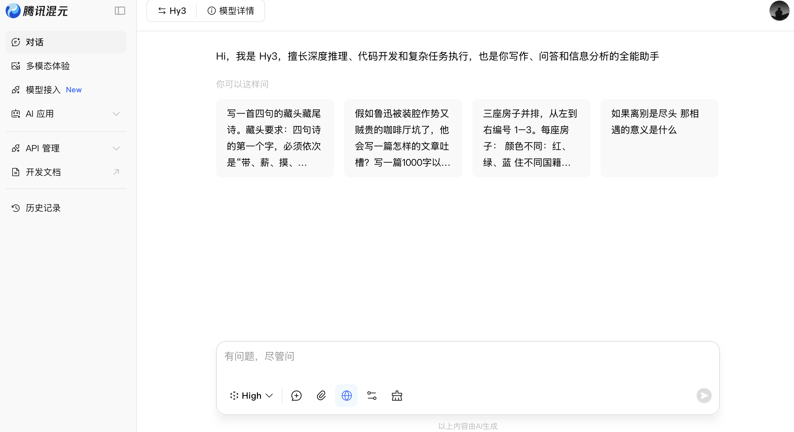

# 腾讯混元官网网页端接入Hy3指南

## 适用场景
普通用户无需API Key，网页端直接体验Hy3的代码生成、逻辑推理能力，适合编程初学者快速上手。

## 操作步骤
1. 访问混元官网：https://hunyuan.tencent.com
2. 微信扫码登录，点击顶部「模型广场」→ 选择「Hy3」进入对话页
3. 发送提示词：请用Python写一个函数，用字典统计英文文本词频，忽略大小写和标点，输出前3高频词，用文本"I love AI. I love coding. AI makes life better!"演示

## 实测截图

## 注意事项
- 网页端默认接入最新Hy3模型，无需额外配置
- 简单任务用「快速思考」模式即可，复杂逻辑可开「深度思考」查看推理过程
